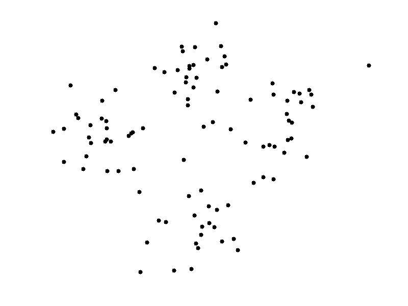
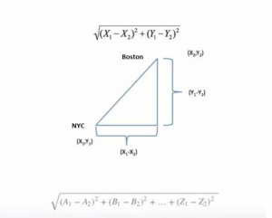

```{r knitr_init, echo = FALSE, results = "asis", cache = FALSE}
library(knitr)
library(rmdformats)

## Global options
options(max.print = "75")
opts_chunk$set(echo    = TRUE,
               cache   = FALSE,
               prompt  = FALSE,
               tidy    = FALSE,
               comment = NA,
               message = FALSE,
               warning = FALSE)
opts_knit$set(width = 75)
```

# Introduction

## What is Clustering?

Clustering is a unsupervised learning method and technique that allows us to group data points close to each other into a single group.

**NOTE : ** Unsupervised learning is one of two broad classes of machine learning, in unsupervised learning, there is no outcome variable to predict. Imagine receiving outcomes of a survey, with the survey results we would like to put customers in certain groups. The trouble is we don't know what these groups are to begin with.

## How can we use clustering?

Clustering can be used in many ways, but the two most common use-cases for clustering are :

1. Simplifying a categorical variable to reduce the number of categories within
2. Cluster a data set entirely

This study will focus on the first application. Regarding the second application, imagine the survey example mentioned above. The goal could be to find groups of people that prefer certain products, without having them buy the products, we can ask them some questions. Based on these answers we can then cluster them into groups of people who would be more likely to buy **product X** or **product Y**. Knowing this information can allow us to market to **group X** differently than to **group Y**. 

## Ways to Cluster:

1. K-Means Clustering
2. Hierarchical Clustering
3. Mean-Shift Clustering
4. Density Based Spatial Clustering of Applications with Noise (DBSCAN)
5. Expectation-Maximization (EM) Clustering using Guassian Mixture Models (GMM)

For this tutorial, we will use a public dataset for Income Census Data

1. Clustering  
The aim of this part is to Cluster a column (country) with 41 modalities (levels) into something more reasonable/simple. This is to reduce number of variables that go into our model because each country can be considered as a separate variable. It can make the model more interpretable if the clusters make sense, i.e. perhapse grouping third-world countries together vs first-world countries.

2. Modeling  
Build a model on the unclustered data and on the clustered data, and compare models.
We will train a binary classification to predict whether someone will have an income higher or lower than 50K.

**Let's get to it!**

```{r fig.show = "hold", out.width = "50%", fig.align = "centre", echo = FALSE}
knitr::include_graphics("dsLogo.png")
```

# Setup Code and Load Data

## Setting up our environment

First we load all our packages that we need.

```{r}
# Setup and Load Packages -------------------------------------------------
options(scipen = 999)
if (!is.element("yaml",     .packages(all.available = TRUE))) install.packages("yaml")
if (!is.element("devtools", .packages(all.available = TRUE))) install.packages("devtools")

for (func in list.files(path = "1_code/0_functions/", full.names = TRUE)) source(func)

# Load Meta data
metaData <- yaml::read_yaml(file = "metadata.yaml")

devtools::install_github(repo = metaData$connectionDetails$github$repo, auth_token = metaData$connectionDetails$github$token)
eaR::pkgInstaller(libs = c("tidyverse", "lubridate", "caret", "factoextra", "e1071", "kableExtra"), destinationFolder = "C:/Users/a009831/Documents/rlibraries")
```

## Loading the data

Load the train and test from [here](https://archive.ics.uci.edu/ml/datasets/census+income)  

We chose this dataset since it is public, hence a reproducible example. We also need to find a dataset with a categorical variable with a lot of modalities.

I have downloaded this file into my local drive and loaded from my local project.  

The data comes in a separate train and test set already but we merged this so that we can choose our own splits.  

I fill out the column names because they're missing in the download.  

```{r}
# Load train and test data ------------------------------------------------
train <- data.table::fread("0_data/Census Income/adult.data.csv") %>%
  eaR::cleanNames(sep = "_")

test <- data.table::fread("0_data/Census Income/adult.test.csv") %>% 
  eaR::cleanNames(sep = "_")

# Fill column names
fillColNames <- c("age", "workclass", "fnlwgt", "education", "education_num", "marital_status", "occupation", "relationship", "race", "sex", "capital_gain", "capital_loss", "hours_per_week", "native_country", "income")

base::names(train) <- fillColNames
base::names(test) <- fillColNames

# Join train and test
dat <- train %>%
  dplyr::bind_rows(test)

# Remove df's from memory
rm(test, train)
```

# Structure and cleaning the data {.tabset .tabset-fade}

## Inspecting the Data

We then need to clean up the data ready for Clustering and modeling.  
To do this I take a look at the columns that we have, 14 variables plus the Income predictor variable.  

```{r}
dplyr::glimpse(dat)
```

### Inspecting the categorical data

I pick out the character columns and inspect the levels of the data.

```{r}
# Character columns
cols <- c("workclass", "education", "marital_status", "occupation", "relationship", "race", "sex", "native_country", "income")

# Loop through columns and get the unique contents and counts
finRes <- c()
finDf <- base::data.frame()
for (vr in cols) {
  tempresult <- dat %>% 
    dplyr::group_by(!!as.name(vr)) %>%
    dplyr::summarise(n = n()) %>%
    dplyr::arrange(-n)
  if(nrow(tempresult) > base::nrow(finDf)) {
    for (ii in 1:(base::nrow(tempresult) - base::nrow(finDf)))  {
      finDf <- finDf %>% dplyr::add_row()
    }
  } else {
    for (ii in 1:(base::nrow(finDf) - base::nrow(tempresult)))  {
      tempresult <- tempresult %>% dplyr::add_row()
    }
  }
  
  finDf[[vr]] <- tempresult[[vr]]
  finDf[[paste0(vr, "_n")]] <- tempresult$n
}

finDf %>% 
  kable() %>%
  kable_styling()
```

## Cleaning the Data

After doing the inspection we can clean up things like "?"'s, names and groupings i.e. native_country = "holand_netherlands", where there is only one observation.

```{r}
# Remove finDf since it is no longer needed
rm(finDf)

# Use the above to clean columns
dat <- dat %>% 
  dplyr::mutate(workclass      = dplyr::if_else(workclass == "?", "other", workclass) %>% eaR::cleanNames(sep = "_"),
                education      = education %>% eaR::cleanNames(sep = "_"),
                marital_status = marital_status %>% eaR::cleanNames(sep = "_"),
                occupation     = dplyr::if_else(occupation == "?", "other", occupation) %>% eaR::cleanNames(sep = "_"),
                relationship   = relationship %>% eaR::cleanNames(sep = "_"),
                race           = race %>% eaR::cleanNames(sep = "_"),
                sex            = sex %>% eaR::cleanNames(sep = "_"),
                native_country = native_country %>% eaR::cleanNames(sep = "_"),
                native_country = dplyr::if_else(native_country %in% c("", "holand_netherlands"), "other", native_country),
                income         = income %>% gsub(pattern = "\\.", replacement = ""))
```

# Clustering {.tabset .tabset-fade}

We will use K-means clustering to define our clusters. Please refer to the appendix for more information on how clustering works.

## Splitting the data

First we use stratified sampling to split our data into 20% for our cluster set and 80 for the rest. We do this to ensure that we do not introduce leakage into our modeling step. 

```{r}
# Stratified sampling separate data into 20 for cluster, 80 train, 20 test
set.seed(123)
splitIndex <- caret::createDataPartition(dat[, native_country],
                                         p     = 0.2,
                                         list  = FALSE,
                                         times = 1)
clusterDF <- dat[splitIndex,  ]
modDF     <- dat[-splitIndex, ]
```

## Creating Clustering Features

Next we need to create some variables to make our cluster for our countries variable that we will cluster

```{r}
# Clustering Scaling/Standardising of variables/ Mean and Standard deviation to create info 
clustPrep <- clusterDF %>% 
  dplyr::group_by(native_country) %>% 
  dplyr::summarise(meanAge     = age %>% mean(na.rm = TRUE),
                   sdAge       = age %>% sd(na.rm = TRUE),
                   meanEdu     = education_num %>% mean(na.rm = TRUE),
                   sdEdu       = education_num %>% sd(na.rm = TRUE),
                   meanWgt     = fnlwgt %>% mean(na.rm = TRUE),
                   sdWgt       = fnlwgt %>% sd(na.rm = TRUE),
                   meanhours   = hours_per_week %>% mean(na.rm = TRUE),
                   sdhours     = hours_per_week %>% sd(na.rm = TRUE),
                   meanCapGain = capital_gain %>% mean(na.rm = TRUE),
                   sdCapGain   = capital_gain %>% sd(na.rm = TRUE),
                   meanCapLoss = capital_loss %>% mean(na.rm = TRUE),
                   sdCapLoss = capital_loss %>% sd(na.rm = TRUE),
                   sexMale     = sum(sex == "male", na.rm = TRUE),
                   sexAll      = n(),
                   incomeLT50  = sum(income == "<=50K", na.rm = TRUE),
                   incomeAll   = n()) %>% 
  dplyr::mutate(incomePropLT50 = incomeLT50 / incomeAll,
                sexMaleProp    = sexMale / sexAll) %>% 
  dplyr::select(-c(incomeLT50, incomeAll, sexMale, sexAll)) %>% 
  base::as.data.frame()

# Keep a copy of countries to use later, we keep this to later join our clusters back on to it
finClust <- clustPrep %>%
  dplyr::select(native_country)

# Drop categorical variable
rownames(clustPrep) <- clustPrep$native_country
clustPrep$native_country <- NULL
```
Let's take a quick look at what the clustering data now looks like

```{r}
clustPrep %>% 
  kable() %>%
  kable_styling()
```

We could extent this by including other features as well, such as the proportions based on **marital_status**. However it would require a bit of work to create all the extra features. We can also include other statistics such as the inter-quartile ranges.

## Selecting the number of clusters

To select our optimal K (clusters) we will use the elbow method, however there are multiple methods to do this, refer to the appendix for a few more plots and a link to more information.

```{r}
set.seed(123)
factoextra::fviz_nbclust(clustPrep, kmeans, method = "wss") +
  geom_vline(xintercept = 3, linetype = 2)
```

I choose 8 clusters due to the output of the countries clusters making more sense than 3 clusters which the elbow originally suggests. You can test more or less clusters and see how our final model performs as well.  
Here you can see the output of the kmeans function:

```{r}
# Build clusters with selected k
clusters <- stats::kmeans(clustPrep, centers = 8)

# Look at the output of kmeans
str(clusters)
```

We can join our clusters back to the corresponding country data that we reserved earlier on:

```{r}
# Extract clusters and join back to finClust which holds country data
finClust$cluster <- clusters$cluster

# View of Countries with corresponding cluster
head(finClust)
```

We can also take a glance some information about each Cluster, the mean Age of each Cluster etc. to give you an idea what each cluster looks like.
```{r}
# Join back original variables for analysis
clustPrep$clusters <- clusters$cluster
rownames(clustPrep) <- NULL

# Summary analysis
clustPrep %>% 
  group_by(clusters) %>% 
  summarise_all(.funs = mean) %>% 
  kable() %>%
  kable_styling()
```

# Modeling {.tabset .tabset-fade}

## Modeling setup

First I join our newly made clusters onto our modeling dataset so we can use it. I also convert the income variable into a factor, giving it a new clean name.

```{r}
# Join clusters onto Modeling Data
modDF <- modDF %>% 
  left_join(finClust, by = c("native_country" = "native_country")) %>% 
  mutate(income = ifelse(income == ">50K", "high", "low") %>% as.factor())
```

## Defineing Modelling Framework

I create some key variables, target and our features for our model.  

Going forward you will see in the variables we refer to **..Orig** and **..Clust**. **Orig** being our data preclustering, with the full country information and **Clust** being our clustered data.

```{r}
# Key variables -----------------------------------------------------------
target <- "income"
featOrig  <- c("age", "workclass", "fnlwgt", "education", "education_num", "marital_status", 
               "occupation", "relationship", "race", "sex", "capital_gain", "capital_loss",
               "hours_per_week", "native_country")
featClust <- c("age", "workclass", "fnlwgt", "education", "education_num", "marital_status", 
               "occupation", "relationship", "race", "sex", "capital_gain", "capital_loss",
               "hours_per_week", "cluster")
```

## Splitting the Data

In the next step we spilt the data into a training and test dataset. We use a 80/20 split.

```{r}
# Split data into 80 train and 20 test 
set.seed(123)
splitIndex <- caret::createDataPartition(modDF[, income],
                                         p     = 0.8,
                                         list  = FALSE,
                                         times = 1)
train <- modDF[splitIndex,  ] %>% as.tibble()
trainTarg <- train[[target]]
train[[target]] <- NULL

test  <- modDF[-splitIndex, ] %>% as.tibble()
testTarg <- test[[target]]
test[[target]] <- NULL
```

## Dummifying

Prepare the data for use in modeling, dummify character variables

```{r}
# Train -------------------------------------------------------------------
trainOrig  <- train[, c(featOrig)]
trainClust <- train[, c(featClust)]

# Dummify variables for train set
trainOrigDummy <- trainOrig %>% dummyVars(formula = "~.", fullRank = F)
trainOrig      <- predict(trainOrigDummy, trainOrig) %>% as.data.frame()
trainOrig[[target]] <- trainTarg

trainClustDummy <- trainClust %>% dummyVars(formula = "~.", fullRank = F)
trainClust      <- predict(trainClustDummy, trainClust) %>% as.data.frame()
trainClust[[target]] <- trainTarg

# Test --------------------------------------------------------------------
testOrig  <- test[, c(featOrig)]
testClust <- test[, c(featClust)]

# Dummify variables for test set
testOrigDummy                 <- testOrig %>% dummyVars(formula = "~.", fullRank = F)
testOrig                      <- predict(testOrigDummy, testOrig) %>% as.data.frame()
testOrig[[target]]            <- testTarg

testClustDummy                  <- testClust %>% dummyVars(formula = "~.", fullRank = F)
testClust                       <- predict(testClustDummy, testClust) %>% as.data.frame()
testClust[[target]]             <- testTarg
```

## Parameter Tuning

In this section we define global parameters for both the models

```{r}
# Setting Parameters ------------------------------------------------------
objControl <- trainControl(method = 'cv', 
                           number = 3,
                           summaryFunction = twoClassSummary, 
                           classProbs = TRUE)
set.seed(123)
gbmGrid <- data.frame(interaction.depth = runif(100, 1 ,   5)    %>% round(0),
                      n.trees           = runif(100, 50,   1000) %>% round(0),
                      n.minobsinnode    = runif(100, 1,    100)  %>% round(0),
                      shrinkage         = runif(100, 0.01, 0.2)  %>% round(4)) %>%
  distinct()
```

## Training The Models {.tabset .tabset-fade}

### Original Countries

Build our model using the original dataset with Countries

```{r}
# Build model using countries ---------------------------------------------
formFeats  <- names(trainOrig)[names(trainOrig) != target]
modFormula <- formula(paste0(target, " ~ ", paste0(formFeats, collapse = " + ")))
set.seed(123)
trainOrigObjModel <- caret::train(modFormula,
                                  data         = trainOrig,
                                  distribution = "bernoulli",
                                  method       = "gbm",
                                  metric       = "ROC",
                                  trControl    = objControl,
                                  tuneGrid     = gbmGrid)

# Look at which  variables are important
summary(trainOrigObjModel)

# Which tuning parameters were most important
print(trainOrigObjModel)
```

Since the data was first split and then dummified, we need to add back some variables to the test set that might have occurred in the training set. Therefore, we nee to add back some missing dummy variables to the test set that were used to build the model.

```{r}
# Adding missing dummy variables to test set ------------------------------
# Original countries
# Coefficient names used in the model
coefNames <- data.frame(names = trainOrigObjModel$coefnames) %>% 
  mutate(n = 1)

testOrigNames <- data.frame(names = names(testOrig)) %>% 
  mutate(n = 1)

# Check difference in Model Coefficient names and test dataset
nameDiff <- dplyr::anti_join(coefNames, testOrigNames)

# Add variables that are missing from test
for (nm in nameDiff$names) {
  testOrig[[nm]] <- 0
}
```

### Clustered Countries

Build our model for the dataset with the Clusters

```{r}
# Build model using clusters ----------------------------------------------
formFeats  <- names(trainClust)[names(trainClust) != target]
modFormula <- formula(paste0(target, " ~ ", paste0(formFeats, collapse = " + ")))
set.seed(123)
trainClustObjModel <- caret::train(modFormula,
                                   data         = trainClust,
                                   distribution = "bernoulli",
                                   method       = "gbm",
                                   metric       = "ROC",
                                   trControl    = objControl,
                                   tuneGrid     = gbmGrid)

# Look at which  variables are important
summary(trainClustObjModel)
```

Again, do the same as before but for our clustered dataset

```{r}
# Adding missing dummy variables to test set ------------------------------
# Clustered countries
# Coefficient names used in the model
coefNames <- data.frame(names = trainClustObjModel$coefnames) %>% 
  mutate(n = 1)

testClustNames <- data.frame(names = names(testClust)) %>% 
  mutate(n = 1)

# Check difference in Model Coefficient names and test dataset
nameDiff <- dplyr::anti_join(coefNames, testClustNames)

# Add variables that are missing from test
for (nm in nameDiff$names) {
  testClust[[nm]] <- 0
}
```

## Model Evaluation {.tabset .tabset-fade}

Model evaluation on both models.

### Original Model on train set

First use the model to predict on the train set, then print some evaluation metrics.

```{r}
# Model evaluation --------------------------------------------------------
# Original with Countries
# Get predictions and probabilities on your test data
origPredRawtrain  <- predict(object = trainOrigObjModel, trainOrig, type = 'raw')
origPredProbtrain <- predict(object = trainOrigObjModel, trainOrig, type = 'prob')

head(origPredRawtrain)
head(origPredProbtrain)

# Overall Accuracy
print(caret::postResample(pred = origPredRawtrain, obs = as.factor(trainOrig[,"income"])))

aucOrigtrain <- pROC::roc(ifelse(trainOrig[,"income"] == "high", 1, 0), origPredProbtrain[[1]])

print(aucOrigtrain$auc)
```

### Original Model on test set

Then use the model to predict on the test set and print some evaluation metrics.

```{r}
# Model evaluation --------------------------------------------------------
# Original with Countries
# Get predictions and probabilities on your test data
origPredRaw  <- predict(object = trainOrigObjModel, testOrig, type = 'raw')
origPredProb <- predict(object = trainOrigObjModel, testOrig, type = 'prob')

head(origPredRaw)
head(origPredProb)

# Overall Accuracy
print(caret::postResample(pred = origPredRaw, obs = as.factor(testOrig[,"income"])))

aucOrig <- pROC::roc(ifelse(testOrig[,"income"] == "high", 1, 0), origPredProb[[1]])

print(aucOrig$auc)
```
### Clustered Model on train set

Repeat the same on the Clustered data for train

```{r}
# Clustered data
# Get predictions and probabilities on your test data
clustPredRawtrain <- predict(object = trainClustObjModel, trainClust, type = 'raw')
clustPredProbtrain <- predict(object = trainClustObjModel, trainClust, type = 'prob')

head(clustPredRawtrain)
head(clustPredProbtrain)

# Overall Accuracy
print(caret::postResample(pred = clustPredRawtrain, obs = as.factor(trainClust[,"income"])))

aucClusttrain <- pROC::roc(ifelse(trainClust[,"income"] == "high", 1, 0), clustPredProbtrain[[1]])

print(aucClusttrain$auc)
```

### Clustered Model on test set

Repeat the same on the Clustered data for test

```{r}
# Clustered data
# Get predictions and probabilities on your test data
clustPredRaw <- predict(object = trainClustObjModel, testClust, type = 'raw')
clustPredProb <- predict(object = trainClustObjModel, testClust, type = 'prob')

head(clustPredRaw)
head(clustPredProb)

# Overall Accuracy
print(caret::postResample(pred = clustPredRaw, obs = as.factor(testClust[,"income"])))

aucClust <- pROC::roc(ifelse(testClust[,"income"] == "high", 1, 0), clustPredProb[[1]])

print(aucClust$auc)
```

Here we can see that there isn't a big difference between the AUC for the test sets. There is a slight improvement although only marginal, ideally we would like to see a bigger improvement but it's still good because the model with clusters is simpler and countries now has a higher variable importance achieving a similar performance.


# Appendix {.tabset .tabset-fade}

## K means Algorithm

With K means Clustering we essentially want to minimize the Intra Cluster distance (Inertia) whilst maximizing the Inter Cluster distance (Dunn Index).

K means finds clusters such that the total intra-cluster variation (or total within-cluster sum of square (WSS)) is minimized. The total WSS measures the compactness of the clustering and we want it to be as small as possible.
Refer to appendix to see how to calculate the distance using Euclidian distance.

This gif shows you how K means works: (see the appendix for links to full explanations)

```{r fig.show = "hold", out.width = "100%", fig.align = "centre", echo = FALSE}

```

## Euclidean distance

```{r fig.show = "hold", out.width = "100%", fig.align = "centre", echo = FALSE}

```

## Other clustering methods and finding K

As mentioned there are other types of clustering and ways to select your optimal K.

```{r}
# Hierarchical clustering with Silhouette method
factoextra::fviz_nbclust(clustPrep, cluster::fanny, method = "silhouette") +
  geom_vline(xintercept = 3, linetype = 2)

# Hierarchical clustering with Gap statistic
factoextra::fviz_nbclust(clustPrep, hcut, method = "gap_stat") +
  geom_vline(xintercept = 3, linetype = 2)

```

[Link to Cluster Metrics](https://medium.com/@ODSC/unsupervised-learning-evaluating-clusters-bd47eed175ce#:~:text=Within%20Cluster%20Sum%20of%20Squares&text=To%20calculate%20WCSS%2C%20you%20first,by%20the%20number%20of%20points.)

[Link to other types of Clustering Algorithms mentioned at the start](https://towardsdatascience.com/the-5-clustering-algorithms-data-scientists-need-to-know-a36d136ef68)